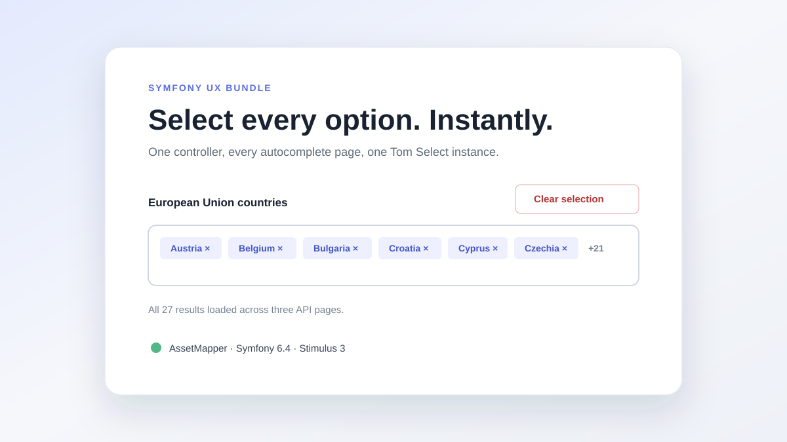

# Symfony UX Autocomplete Select All

[](https://packagist.org/packages/hugoseigle/symfony-ux-autocomplete-select-all)
[](https://packagist.org/packages/hugoseigle/symfony-ux-autocomplete-select-all/stats)
[](https://packagist.org/packages/hugoseigle/symfony-ux-autocomplete-select-all/stats)
[](https://github.com/HugoSEIGLE/symfony-ux-autocomplete-select-all/stargazers)
[](https://github.com/HugoSEIGLE/symfony-ux-autocomplete-select-all/releases)

[](https://github.com/HugoSEIGLE/symfony-ux-autocomplete-select-all/actions/workflows/ci.yaml)
[](https://codecov.io/gh/HugoSEIGLE/symfony-ux-autocomplete-select-all)
[](https://github.com/HugoSEIGLE/symfony-ux-autocomplete-select-all/actions/workflows/codeql.yaml)
[](phpstan.neon.dist)
[](composer.json)
[](LICENSE)

A small Symfony UX bundle that adds accessible **Select all** and **Deselect
all** controls to a multiple [Symfony UX Autocomplete](https://symfony.com/bundles/ux-autocomplete/current/index.html)
field.

It follows the endpoint's pagination, reuses the Tom Select instance managed by
Symfony UX and works with both AssetMapper and Webpack Encore.



## Features

- Selects results across every remote autocomplete page.
- Supports Symfony UX's `next_page` response and the historical 10-item page
  format.
- Keeps controls synchronized when the selection changes.
- Uses Stimulus values and targets for labels, classes and advanced settings.
- Aborts in-flight requests and removes every listener and generated element on
  `disconnect()`.
- Does not instantiate or replace Tom Select.
- Supports grouped Symfony UX Autocomplete responses.

## Requirements

| Dependency              | Supported versions            |
| ----------------------- | ----------------------------- |
| PHP                     | 8.2, 8.3, 8.4, 8.5            |
| Symfony                 | 6.4, 7.x, 8.x                 |
| Symfony UX Autocomplete | 2.17+ or 3.x                  |
| Stimulus                | 3.2 or later                  |
| Assets                  | AssetMapper or Webpack Encore |

## Installation

```bash
composer require hugoseigle/symfony-ux-autocomplete-select-all
```

If Symfony Flex does not register third-party bundles in your application,
enable it manually:

```php
// config/bundles.php
use HugoSeigle\SymfonyUx\AutocompleteSelectAll\SymfonyUxAutocompleteSelectAllBundle;

return [
    // ...
    SymfonyUxAutocompleteSelectAllBundle::class => ['all' => true],
];
```

The package exposes its controller through the standard Symfony UX asset
manifest. AssetMapper consumes it directly; Encore installs and resolves the
corresponding npm package through the usual Symfony UX workflow.

See the complete [installation guide](docs/installation.md), including manual
AssetMapper and Encore setup.

## Usage

Place this controller on a wrapper and mark the multiple autocomplete field as
its `field` target:

```twig


<div {{ stimulus_controller(select_all_controller, {
    selectAllLabel: 'Select every country',
    deselectAllLabel: 'Clear the selection'
}) }}>
    <select
        multiple
        {{ stimulus_controller('symfony/ux-autocomplete/autocomplete', {
            url: path('app_country_autocomplete')
        }) }}
        {{ stimulus_target(select_all_controller, 'field') }}
    ></select>
</div>
```

The autocomplete endpoint keeps its normal Symfony UX response:

```json
{
    "results": [
        { "value": "1", "text": "France" },
        { "value": "2", "text": "Germany" }
    ],
    "next_page": "/autocomplete/countries?page=2"
}
```

No separate URL is needed: by default, the controller reads the URL value
already configured on Symfony UX Autocomplete.

## Configuration

| Stimulus value       | Type   | Default                                             | Purpose                                   |
| -------------------- | ------ | --------------------------------------------------- | ----------------------------------------- |
| `url`                | string | Autocomplete URL                                    | Overrides the endpoint used by Select all |
| `selectAllLabel`     | string | `Select All`                                        | Select button label                       |
| `deselectAllLabel`   | string | `Deselect All`                                      | Clear button label                        |
| `selectAllClasses`   | string | `btn btn-outline-primary btn-sm select-all-button`  | Select button classes                     |
| `deselectAllClasses` | string | `btn btn-outline-danger btn-sm unselect-all-button` | Clear button classes                      |
| `controlsClasses`    | string | `autocomplete-select-all-controls`                  | Generated controls wrapper classes        |
| `pageSize`           | number | `10`                                                | Legacy pagination fallback size           |
| `maxPages`           | number | `1000`                                              | Pagination loop safety limit              |

Buttons use the native `hidden` attribute, so Bootstrap is optional. Replace the
class values when using another design system.

See [configuration](docs/configuration.md) and [examples](docs/examples.md) for
custom controls, Symfony Forms and both asset systems.

## Demo

The [`demo/`](demo/) directory is a complete Symfony 6.4 AssetMapper
application. It installs this bundle from its parent directory with a Composer
`path` repository.

```bash
cd demo
composer install
symfony serve
```

Then open the URL printed by Symfony CLI.

## Contributing

Bug reports and pull requests are welcome. Read [CONTRIBUTING.md](CONTRIBUTING.md)
for the local workflow, quality checks and contribution rules.

Please report vulnerabilities privately as described in
[SECURITY.md](SECURITY.md).

## Roadmap

- Add optional progress feedback for very large datasets.
- Evaluate an opt-in confirmation threshold before selecting thousands of
  records.
- Track future Symfony UX Autocomplete pagination changes without relying on
  private APIs.

Backward compatibility follows semantic versioning. See
[CHANGELOG.md](CHANGELOG.md) for release notes.

## License

Symfony UX Autocomplete Select All is released under the [MIT License](LICENSE).
